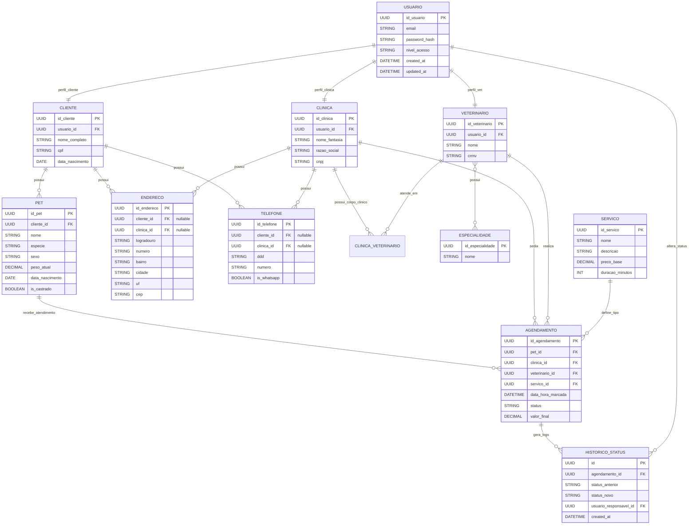

# PetCare

Este projeto foi desenhado para servir como uma plataforma completa para o ecossistema pet, unindo uma interface de alta fidelidade e focada no usuário com um backend robusto e seguro. O sistema abrange desde a captação e cadastro de tutores até o agendamento de serviços, garantindo escalabilidade e proteção de dados.

### O que este projeto demonstra:
* **UX/UI Design Estratégico:** Interfaces prototipadas com foco na jornada do usuário, fluidez de navegação e aplicação rigorosa de guias de estilo.
* **Agilidade na Prática:** Organização das entregas baseada em metodologias ágeis, com definição clara de TimeBoxes, Sprints e Velocity.
* **Segurança e Conformidade:** Arquitetura de dados alinhada à LGPD e autenticação robusta utilizando hashing de senhas.
* **Modelagem de Domínio:** Estrutura relacional bem definida para gerenciar entidades fundamentais como `usuario` e `pet`.
* **Padronização REST:** Respostas JSON consistentes para sucesso e erro na comunicação entre o client e a API.

---

## 📋 Critérios de Aceite (Sprint 1)
**Período (TimeBox):** 10/04/2026 - 17/04/2026

### 1. Landing Page
* **Responsividade:** O layout deve ser perfeitamente adaptável a diferentes tamanhos de tela (Mobile, Tablet e Desktop).
* **Diretrizes de UX:** Foco contínuo na usabilidade e fluidez da navegação, com elementos de interface intuitivos.
* **Identidade Visual:** Aplicação estrita da paleta de cores definida no design system do projeto.
* **Acesso:** O link (Call to Action) de redirecionamento para a tela de login deve estar visível e funcional em qualquer dispositivo.

### 2. Mecanismo de Login
**Velocity:** 40
* **Interface (UX/UI):** Manter a consistência visual com o padrão de cores do projeto.
* **Regras de Input:**
  * **Campo de Usuário:** Limite máximo estrito de 10 caracteres.
  * **Campo de Senha:** Deve aceitar letras, números e caracteres especiais. É obrigatória a implementação de máscara de ocultação (ex: asteriscos ou pontos) com a funcionalidade de "visualizar senha" (toggle).
* **Segurança (Backend/DB):**
  * **Criptografia:** É terminantemente proibido o armazenamento de senhas em texto simples (*plain text*).
  * **Hashing:** Utilização de algoritmos de hash seguros.
  * **Validação:** O processo de autenticação ocorre exclusivamente pela comparação entre o hash armazenado no banco de dados e o hash gerado a partir da senha digitada no momento do login.

### 3. Cadastro de Tutores e Pets (Onboarding)
**Velocity:** 8
* **Privacidade e Compliance:** Total conformidade com as diretrizes da LGPD (Lei Geral de Proteção de Dados).
* **Dados Pessoais (Obrigatórios):** E-mail (com validação rigorosa de formato), Idade, Endereço e Telefone/Celular.
* **Perfil Pet:** Coleta da quantidade de animais e identificação de suas respectivas espécies.
* **Regra de Negócio (Bloqueante):** O usuário deve, obrigatoriamente, registrar e possuir vínculo com ao menos um animal (Cachorro, Gato, Passarinho ou Outros) para que o cadastro seja concluído com sucesso.

### 4. Agendamento de Consultas
**Velocity:** 20
* **Interface de Seleção:** Exibição de um calendário interativo e amigável para a escolha de datas.
* **Dados do Agendamento:** O registro deve capturar e exibir com clareza:
  * Clínica e Nome do Médico Veterinário.
  * Identificação do Animal.
  * Horário e Local da consulta.
  * Telefone de contato da clínica.
  * Campo de Observações (Obs) para notas adicionais.

---
## Diagrama DB.


---
## 🔌 Formato de Resposta API

Sucesso (Ex: 201 Created):

```json
{
  "success": true,
  "status_code": 201,
  "message": "Agendamento criado com sucesso.",
  "data": { "id": 12, "pet_id": 3, "date": "2026-04-15 14:30:00" }
}
```

Erro (Ex: 400 Bad Request):

```json
{
 "success": false,
  "message": "Falha na validação dos dados.",
  "errors": { "email": ["Formato de e-mail inválido"] }
}
```

---

## ⭐ Gostou do projeto?
Sinta-se à vontade para dar um fork e usar como base para seus próprios estudos e evoluções de arquitetura!
